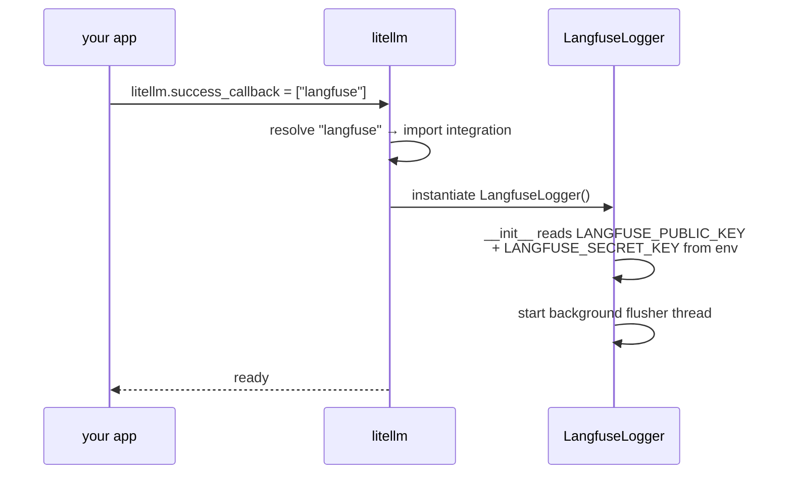
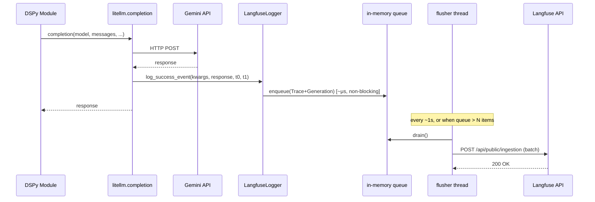

# LiteLLM → Langfuse callback: how observability piggybacks on the chokepoint

A learning note on the architectural pattern behind LLM observability SDKs.
Uses Langfuse as the example; the same pattern applies to MLflow, Logfire,
OpenLLMetry, Phoenix, and in-house equivalents.

## 1. The layered stack

```
┌───────────────────────────────────────────┐
│ DSPy Module  (DebateModule, etc.)         │  ← your code
└──────────────────┬────────────────────────┘
                   │
                   ▼
┌───────────────────────────────────────────┐
│ dspy.LM                                   │  ← DSPy's LLM wrapper
└──────────────────┬────────────────────────┘
                   │
                   ▼
┌───────────────────────────────────────────┐
│ litellm.completion(...)                   │  ← CHOKEPOINT — every LLM call
│                                           │
│   After completing, iterates:             │
│   litellm.success_callback = ["langfuse"] │
└────┬─────────────────────────┬────────────┘
     │                         │
     ▼                         ▼
 Gemini / OpenAI /    LangfuseLogger.log_success_event(
 Anthropic / …          kwargs, response_obj,
 (real network call)    start_time, end_time
                       )
```

Every DSPy call goes through LiteLLM. Register a callback there, and you
capture everything built above it for free — DSPy doesn't have to know
Langfuse exists.

The general lesson: **instrument the lowest shared layer.** Everything above
it is captured automatically.

---

## 2. Registration — one line of code, what happens



---

## 3. Runtime — two-stage flow (sync enqueue → async POST)



**Key property:** the user-facing LLM call returns at the `LL-->>M` arrow.
The network POST to Langfuse happens later, in a different thread. Your
`/ask` latency doesn't include Langfuse's network round-trip.

---

## 4. Data shape translation

LiteLLM hands the callback data in OpenAI-ish shape. The callback translates
it to Langfuse's trace/generation model.

**LiteLLM callback kwargs:**
```python
{
    "model": "gemini/gemini-2.5-flash-lite",
    "messages": [{"role": "user", "content": "..."}],
    "response_obj": {
        "choices": [{"message": {"content": "..."}}],
        "usage": {"prompt_tokens": 123, "completion_tokens": 45}
    },
    "start_time": 1776670000.0,
    "end_time": 1776670001.2,
}
```

**Langfuse shape (what gets POSTed):**
```python
Trace(
    name="llm_call",
    session_id="conv-oa-42",
    user_id="optional",
)
└── Generation(
        model="gemini/gemini-2.5-flash-lite",
        input=[{"role": "user", "content": "..."}],
        output="...",
        usage={"input": 123, "output": 45, "unit": "TOKENS"},
        start_time=...,
        end_time=...,
    )
```

---

## 5. Inside `LangfuseLogger.log_success_event` (conceptual)

```python
class LangfuseLogger(CustomLogger):
    def __init__(self):
        self.client = Langfuse()   # env-based auth, starts flusher

    def log_success_event(self, kwargs, response_obj, start_time, end_time):
        trace = self.client.trace(name="llm_call")
        trace.generation(
            model=kwargs["model"],
            input=kwargs["messages"],
            output=response_obj.choices[0].message.content,
            usage={
                "input":  response_obj.usage.prompt_tokens,
                "output": response_obj.usage.completion_tokens,
            },
            start_time=start_time,
            end_time=end_time,
        )
        # returns immediately — just enqueued
```

The method enqueues. It does NOT network.

---

## 6. Properties worth knowing

| Property               | What it means                              | Where it lives                   |
|------------------------|--------------------------------------------|----------------------------------|
| Non-blocking           | `/ask` latency unaffected                  | Two-stage flow                   |
| Graceful degradation   | App works when Langfuse is down            | Flusher retries, then drops      |
| Env-based auth         | No secret handling in app code             | `LangfuseLogger.__init__`        |
| Flush on shutdown      | Railway restart → final events still sent  | `atexit` hook on `Langfuse()`    |
| Zero DSPy coupling     | DSPy doesn't know Langfuse exists          | Chokepoint pattern               |

---

## 7. How the in-memory thread-safe queue is implemented

This is the standard Python SDK pattern — Langfuse, Sentry, Datadog,
Honeycomb, OpenTelemetry OTLP exporter all converge on a variant of this.
Exact details differ per SDK; the shape is the same.

Two pieces: a **thread-safe queue** + a **background flusher thread**
consuming it.

```python
import queue
import threading
import time
import atexit

class Client:
    def __init__(self, flush_interval=1.0, flush_at=15, max_queue_size=10000):
        # queue.Queue is threadsafe out of the box — put/get use a Lock
        # internally, and it owns the "not full" / "not empty" Conditions.
        self._queue: queue.Queue = queue.Queue(maxsize=max_queue_size)
        self._flush_interval = flush_interval
        self._flush_at = flush_at
        self._stop_event = threading.Event()

        self._flusher = threading.Thread(
            target=self._flush_loop,
            name="langfuse-flusher",
            daemon=True,   # dies with the main process
        )
        self._flusher.start()

        atexit.register(self.shutdown)

    def enqueue(self, event: dict) -> None:
        try:
            self._queue.put_nowait(event)
        except queue.Full:
            # graceful degradation — drop rather than block the user's call
            self._dropped += 1

    def _flush_loop(self) -> None:
        while not self._stop_event.is_set():
            batch = self._drain(max_items=self._flush_at,
                                timeout=self._flush_interval)
            if batch:
                self._send(batch)

    def _drain(self, max_items, timeout):
        batch = []
        deadline = time.monotonic() + timeout
        # Block for the first item so we don't hot-loop when idle.
        try:
            batch.append(self._queue.get(timeout=timeout))
        except queue.Empty:
            return batch
        # Then drain up to max_items or until the deadline, non-blocking.
        while len(batch) < max_items and time.monotonic() < deadline:
            try:
                batch.append(self._queue.get_nowait())
            except queue.Empty:
                break
        return batch

    def _send(self, batch):
        # POST with retry + exponential backoff.
        for attempt in range(3):
            try:
                requests.post(self._url, json=batch, timeout=10)
                return
            except Exception:
                time.sleep(2 ** attempt)
        # Exhausted — drop, log, move on. Availability > observability.

    def shutdown(self):
        self._stop_event.set()
        # Final flush — this is why atexit matters.
        remaining = []
        while not self._queue.empty():
            try:
                remaining.append(self._queue.get_nowait())
            except queue.Empty:
                break
        if remaining:
            self._send(remaining)
```

### Design choices worth knowing

**1. `queue.Queue` is the stdlib's threadsafe FIFO.** Internally it uses a
`collections.deque` + a `threading.Lock` + two `threading.Condition`s (for
"not full" and "not empty" wait-states). `put_nowait` / `get_nowait` never
block; `put` / `get` with a timeout do. You don't handroll the locking —
you reuse the queue.

**2. `daemon=True`** on the flusher thread means Python's interpreter exit
doesn't wait for it. Combined with `atexit.register(shutdown)`, you get:
"flush cleanly if we have time, abandon if we don't." Prevents the app
from hanging on shutdown when the API is unreachable.

**3. Two flush triggers:**
- **Size**: drain the batch when it hits `flush_at` items (often 15–100).
  Bounds per-POST size.
- **Time**: drain every `flush_interval` (often 0.5–5 s). Bounds the
  latency from "event fired" to "event visible in the UI."

**4. Backpressure via `maxsize`.** If the flusher falls behind (network
slow, API down), the queue eventually fills. `put_nowait` throws
`queue.Full`. The SDK drops the event and increments a counter —
**never blocks the user's LLM call.**

**5. Retry with exponential backoff.** 3 attempts with 1 s / 2 s / 4 s
pauses is typical. After exhaustion, the batch is dropped — you lose
observability, not availability.

**6. Shutdown semantics.** On `atexit`:
- Signal the flusher to stop its loop.
- Drain whatever's in the queue.
- One final best-effort POST.
- Return within a bounded timeout (Python's `atexit` doesn't wait forever).

---

## 8. Why this pattern generalises

The same architecture works for MLflow, Logfire, OpenLLMetry, Phoenix,
Sentry, Datadog, OpenTelemetry OTLP, custom in-house tools. They all plug
into LiteLLM's callback contract (or an equivalent chokepoint for their
domain) and ship events via a non-blocking queue + batched POST.

Pick the UI you prefer; the instrumentation point is identical. The
engineering effort behind "three lines to enable Langfuse" is ~500 lines
of queue management, retry logic, shutdown handling, and data-shape
translation — which is exactly the value an observability SDK gives you
for free.

---

## Caveats

The section 7 code is the **canonical pattern** shared across Python SDKs,
not a line-for-line copy of Langfuse's implementation. Exact details
(queue type, backoff curve, sync vs async path selection) differ per
library. Read the source if the specifics matter for your use case.
